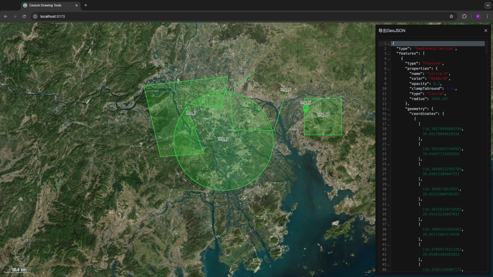
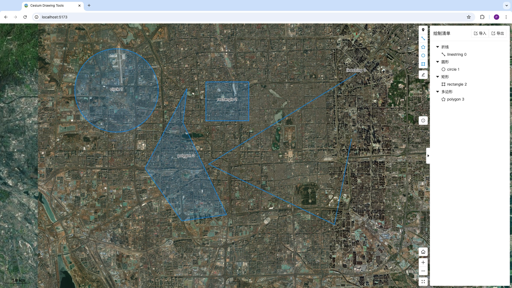
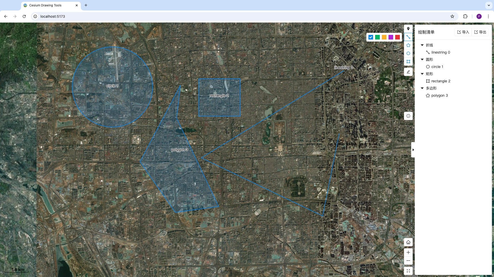
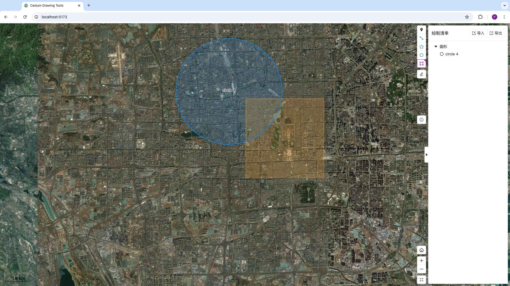
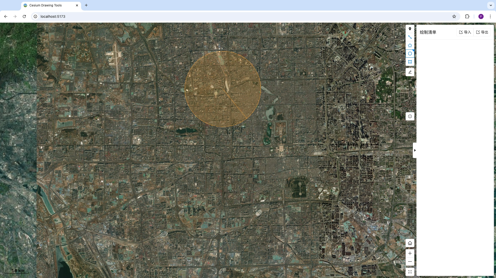
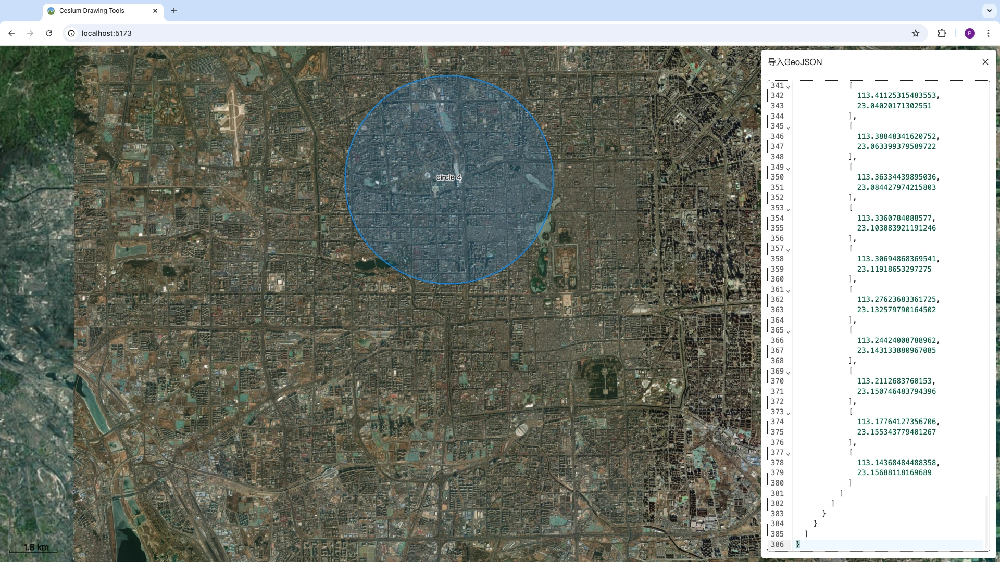
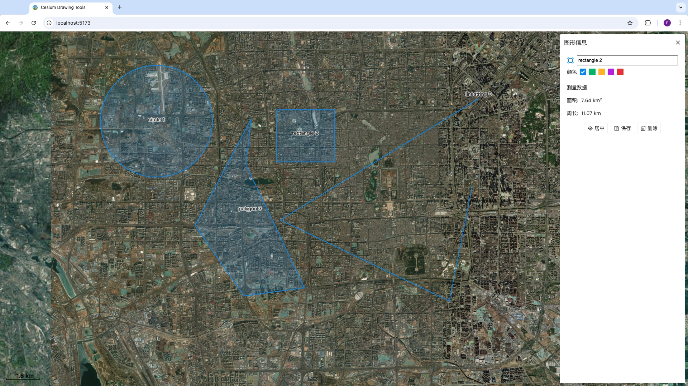

# Cesium-Drawing

这是一个基于vue3开发的Cesium基础绘图工具。目前支持点，折线，多边形，圆形以及矩形的绘制，并提供了周长，面积的计算。

### 说明

核心功能:

- 鼠标交互绘图，编辑图形
- 支持基本图形：点，线，多边形，圆形，矩形
- 支持周长，面积的计算
- 支持图形的颜色，名称等编辑
- 支持GeoJSON导入、导出
- 可支持自定义图形的扩展
- Cesium组件封装：比例尺，缩放，绘图
- 其它组件：侧边栏，SVG图标，SVG标标按钮，代码编辑器(json)
- 支持暗色主题（跟随系统）

兼容性:

- 浏览器：支持Chrome, Safari。对于其它浏览器没测试
- Cesium：支持Cesium最低版本为Cesium@1.116，最高版本为Cesium@1.121。对于其它版本没有测试

本工具采用的技术栈是:

- Vue 3.4.29
- Vite 5.3.1
- Pinia 2.2.2
- Cesium 1.121
- geojson 0.5.0
- turf 3.0.14

本示例包括核心绘图代码，Cesium代码的组件化封装。以及完整的使用例子，您可以根据需要抽取部分代码。

- 绘图相关代码: 位于src/components/Graphics
- Cesium相关: 位于src/components/Mapview

## 演示

演示地址：http://120.26.202.82:8088/

### 安装

```sh
pnpm install
pnpm dev
pnpm build
```

## 使用

### Cesium的使用

#### 添加Cesium

```sh
pnpm add cesium
```

如果您使vite构建，需要安装vite-plugin-cesium插件

```sh
pnpm add vite-plugin-cesium -D
```

并且在`vue.config.js`中添加以下内容：

```js
import { defineConfig } from 'vite'
import vue from '@vitejs/plugin-vue'
import cesium from 'vite-plugin-cesium' //这行是需要添加的

export default defineConfig({
  plugins: [
    vue(),
    vueJsx(),
    cesium() //这行是需要添加的
  ]
})
```

如果您使用其它构建工具，请了解该工具的相关配置。

#### 在模板中显示Cesium地图

```HTML
<template>
    <MapViewer id="map"/>
</template>
<script lang="ts" setup>
    import { ref, nextTick, watch } from 'vue'
    import { MapViewer } from '@/components/MapView'
</script>
```

#### 使用绘图工具

```js
<template>
    <div id="map" class="mapviewer"/>
</template>
<script lang="ts" setup>
    import { vue,ref, onMounted } from '@/components/Graphics'
    import { DrawableGraphic, Drawer, GraphicType } from '@/components/Graphics'
    import { useDrawingStore } from '@/store/drawing'

    const store = useDrawingStore()
    const viewer = ref();
    let drawer: Drawer | null = null

    function init(){
        const _viewer = new Cesium.Viewer('map')
        initDrawer(_viewer)
        viewer.value = _viewer;
    }
    function initDrawer(viewer:Cesium.Viewer){
        drawer = new Drawer(viewer)
        drawer.addListener(graphicListener)
        drawer.enableClickListener()
    }

    onMounted(()=>{
        init()
    })
</script>
<style scoped>
.mapviewer {
    position: relative;
    width: 100%;
    height: 100%;
    margin: 0;
    padding: 0;
    overflow: hidden;
</style>
```

#### 绘图参数

开始绘图

```js
drawer?.drawPoint(options)
```

#### Methods

- `drawPoint(options)` 开始绘制点
- `drawLine(options)` 开始绘制折线
- `drawPolygon(options)` 开始绘图多边形
- `drawCircle(options)` 开始绘制圆形
- `drawRectangle(options)` 开始绘制矩形

#### Options

| 参数          | 数据类型 | 说明                                                         |
| ------------- | -------- | ------------------------------------------------------------ |
| pixelSize     | number   | 点的大小，用于指定图形的顶点，控制点的大小                   |
| color         | string   | 图形处于正常状态的颜色。如：#ff0000                          |
| selectedColor | string   | 图形处于选中状态的颜色                                       |
| editColor     | string   | 图形处于编辑状态的颜色                                       |
| opacity       | number   | 填充的透明度。图形中用这个上面的各颜色带这个透明度去填充图形 |
| width         | number   | 边框线的宽度                                                 |
| showLabel     | boolean  | 是否显示图形的文本标签                                       |
| labelFont     | string   | 图形文本标签的字体                                           |

> 具体使用请参考：src/components/MapView/src/drawing/MapDrawing.vue

#### 完整示例

> 完整示例请参考：src/App.vue

### 效果图

<p style="100%">
  <a href="./snapshot/a7.webp" target="_blank"></a>
  <a href="./snapshot/a1.webp" target="_blank"></a>
</p> 
<p style="100%">
  <a href="./snapshot/a2.webp" target="_blank"></a>
  <a href="./snapshot/a3.webp" target="_blank"></a>
</p>
<p style="100%">
  <a href="./snapshot/a5.webp" target="_blank"></a>
  <a href="./snapshot/a6.webp" target="_blank"></a>
</p>
<p style="100%">
  <a href="./snapshot/a4.webp" target="_blank"></a>
</p>

### Cesium交流群

> 点击链接加入群聊【Cesium开发者杂谈】：[](https://qm.qq.com/q/S9UlNce7Oq)

### 捐赠

> 如果您觉得这个项目帮助到了您，您可以请作者喝一杯咖啡表示鼓励


